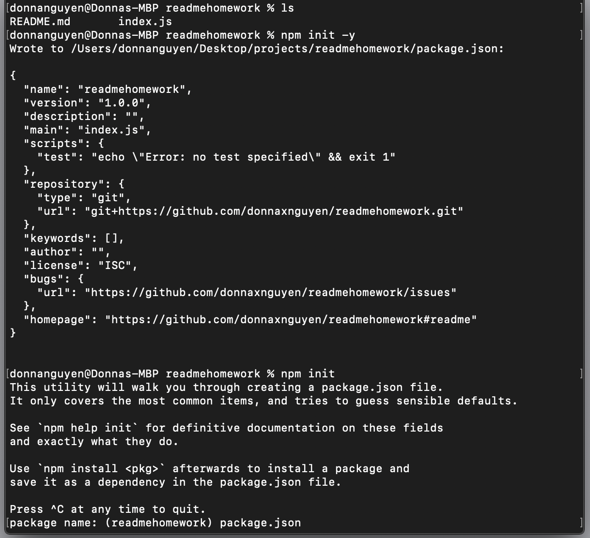
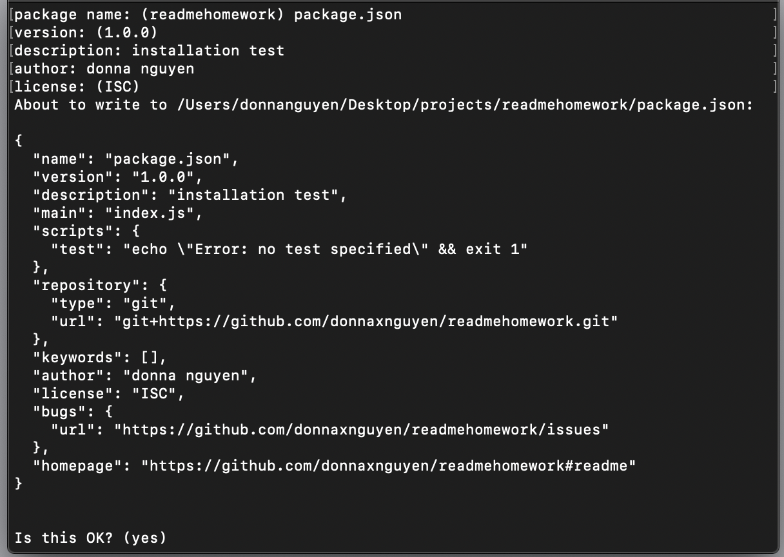
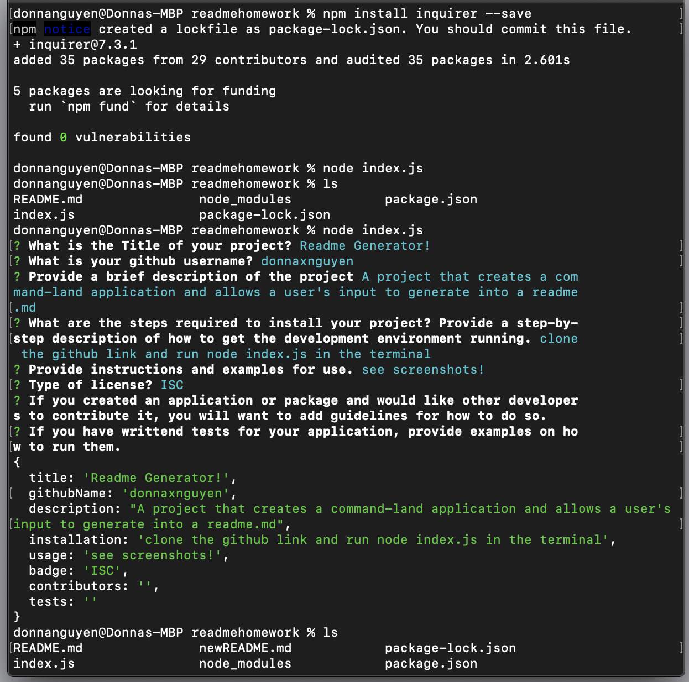

# Read Me Generator

## Project description
This project uses the command-line and allows a user to input their info to generate a readme.md

## Table of Contents
* [Installation](##installation)
* [Usage](##Usage)
* [License](##License)
* [Contributing](##Contributing)
* [Tests](##Tests)
* [Questions](##Questions)

### Installation
* Clone this github link into Terminal
* Run the command "node index.js"

### Usage
* Started with "npm init -y" then ran "npm init"
* Created a package.json folder 
* Ran the "npm install inquirer --save" and ran node.js to show that the questions will run. 
* Take a look at the generated readme.md [HERE](https://github.com/donnaxnguyen/readmehomework/blob/master/newREADME.md)

### Contributing

### Tests
See screenshots below!

### Questions
### GitHub: donnaxnguyen  
### License
This project is licensed under the .
        